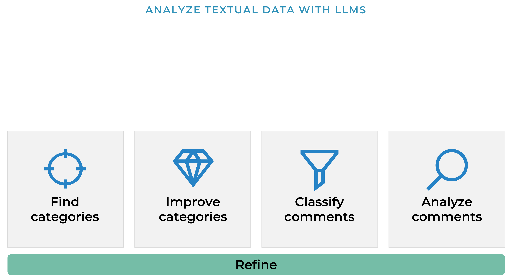

# Analyze text with LLM

This workshop is based on a collaboration with Babylotse, a program offered by Kinderschutzbund –
Bezirksverband Frankfurt am Main e. V.. We extend our sincere thanks to Nicola Küpelikilinc (<babylotse@kinderschutzbund-frankfurt.de>) for her permission to publish and use the data.



## License
### Code
[](https://www.gnu.org/licenses/gpl-3.0)
 
### Data 
[](https://creativecommons.org/licenses/by/4.0/)

The [survey data](https://github.com/CorrelAid/workshop-babylotse/blob/main/data/Umfrage%20DE%20submissions%202024-07-31%2000_25.csv) are licensed under CC-BY 4.0. Attribution can be done in the form:

🇬🇧: _"Family satisfaction in Frankfurt - Babylotse survey 2024" by [Babylotse Frankfurt](https://babylotse-frankfurt.de/), accessible [on GitHub](https://raw.githubusercontent.com/CorrelAid/workshop-babylotse/refs/heads/main/data/Umfrage%20DE%20submissions%202024-07-31%2000_25.csv)_ 
:de: _"Zufriedenheit von Familien in Frankfurt - Babylotse Umfrage 2024" von [Babylotse Frankfurt](https://babylotse-frankfurt.de/), verfügbar [auf GitHub](https://raw.githubusercontent.com/CorrelAid/workshop-babylotse/refs/heads/main/data/Umfrage%20DE%20submissions%202024-07-31%2000_25.csv)_ 

## Setup

1. Install [uv](https://docs.astral.sh/uv/getting-started/installation/)
1. Clone this repo `git clone https://github.com/CorrelAid/workshop-babylotse.git`
1. Open your terminal and navigate to the repository (which I will call `root` directory)
1. Run `uv venv` to create a new virtual environment `.venv` with all the dependencies listed in `pyproject.toml`. Alternatively, you can also run `uv sync`, if you are already in a fresh environment (like conda)
1. Now you can use either your IDE or `jupyter lab` to access the notebooks

### Using LLM

To be able to use a LLM, you need to either have one installed locally (see [Ollama](https://ollama.com/)), or you need an API key.

- Use [OpenAI Platform](https://platform.openai.com/), register for an account and create your [API key](https://platform.openai.com/api-keys)
- Use [Groq Cloud](https://console.groq.com/login), register for an account and create your [API key](https://console.groq.com/keys)

I have listed the packages for each API as an optional dependency, thus you have to install the related Python library.

For openai:

```bash
uv sync --extra openai
```

For Groq:

```bash
uv sync --extra groq
```

Now you have to put your API key into the `.env` file:

1. Copy `.env.default` and rename it to `.env`
2. Fill in your API key for either OpenAI or Groq

You are ready to start with the notebooks!
